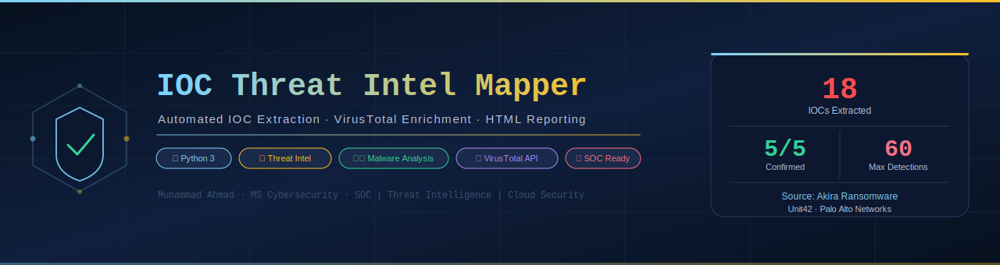
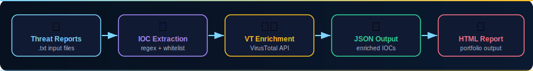
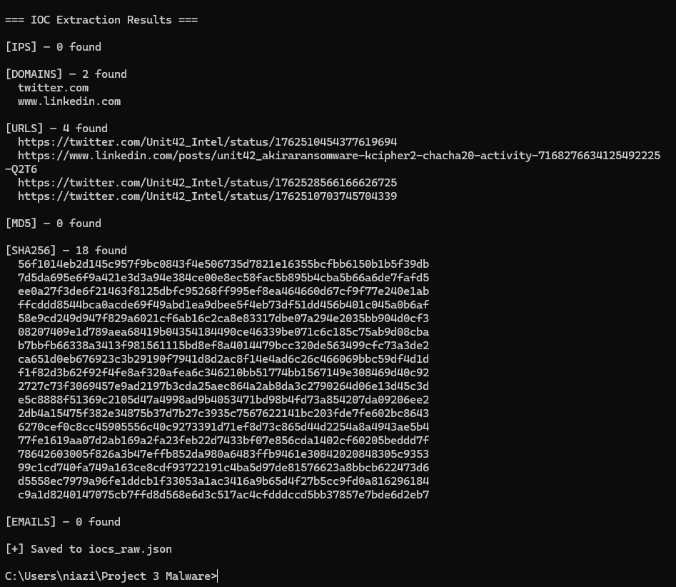
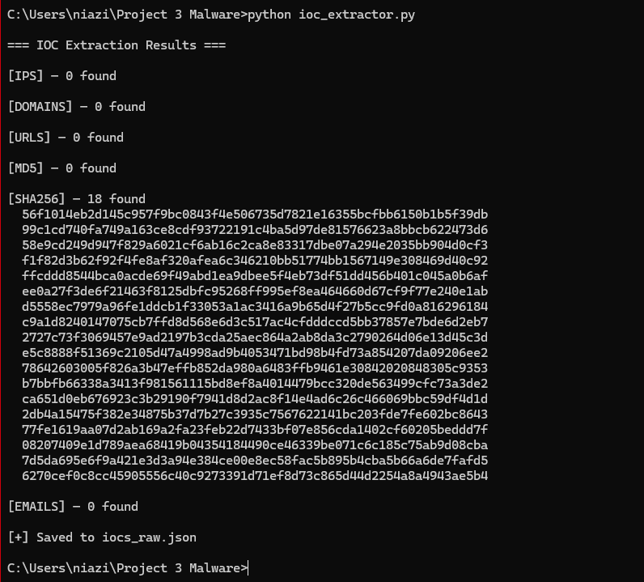
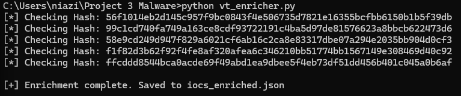
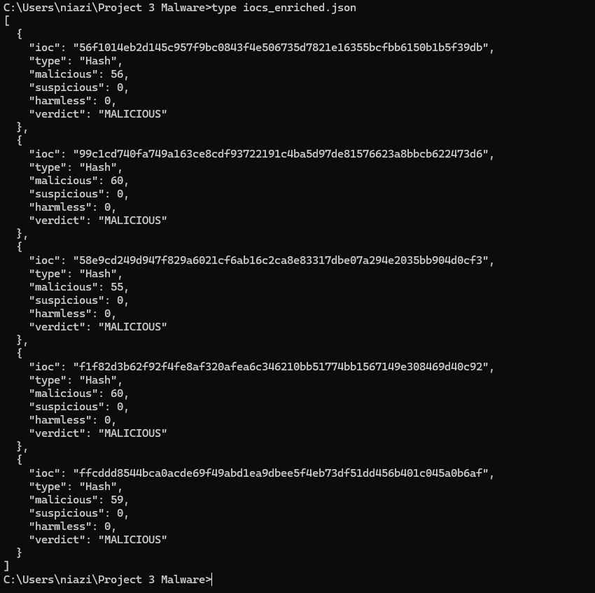
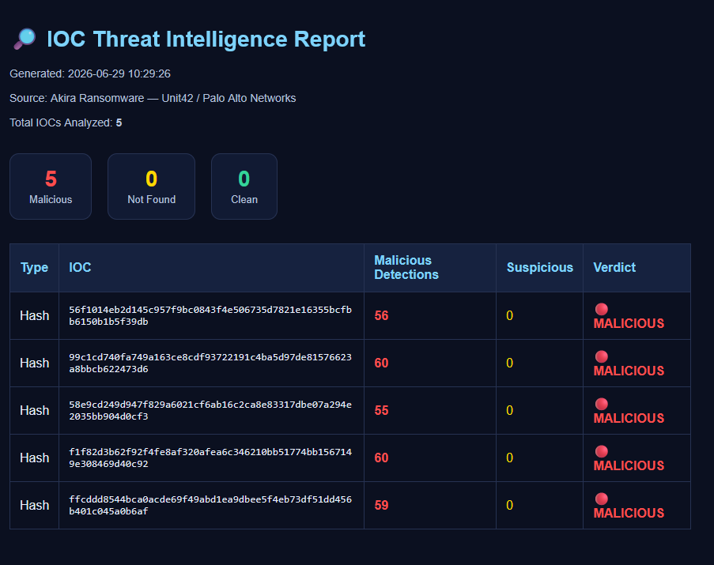

<p align="center">
  
</p>

<p align="center">
  
  
  
  
</p>

<p align="center">
  
  
  
  
</p>

---

## 🔎 Overview

**IOC Threat Intel Mapper** is an automated cybersecurity pipeline that extracts **Indicators of Compromise (IOCs)** from real-world threat intelligence reports, enriches them using the **VirusTotal API**, and generates a professional **HTML threat intelligence report** — mimicking exactly what SOC Analysts and Threat Intelligence teams do in enterprise environments.

> This project was built as part of a hands-on cybersecurity portfolio targeting **SOC Analyst** and **Threat Intelligence** roles.

---

## ⚙️ Workflow

<p align="center">
  
</p>

| Stage | Script | Description |
|---|---|---|
| 1️⃣ Input | `sample_reports/*.txt` | Real threat intelligence reports (Unit42, Cisco Talos, Sophos) |
| 2️⃣ Extract | `ioc_extractor.py` | Regex-based IOC extraction with false-positive whitelist filtering |
| 3️⃣ Enrich | `vt_enricher.py` | VirusTotal API enrichment with malicious/clean verdict |
| 4️⃣ Output | `output/iocs_enriched.json` | Structured JSON with detection counts per antivirus engine |
| 5️⃣ Report | `report_generator.py` | Professional dark-themed HTML report with summary statistics |

---

## 🏆 Results

> **Target:** Akira Ransomware IOCs — sourced from Palo Alto Networks Unit42

| Metric | Value |
|---|---|
| SHA256 Hashes Extracted | **18** |
| Hashes Enriched via VirusTotal | **5** |
| Confirmed MALICIOUS | **5 / 5 (100%)** |
| Max Engine Detections | **60 / 72 engines** |
| False Positives Filtered | **6 (social media URLs)** |

---

## 📸 Screenshots

### Step 1 — IOC Extraction (18 SHA256 Hashes Found)
<p align="center">
  
</p>

### Step 2 — Whitelist Filter Applied (False Positives Removed)
<p align="center">
  
</p>

### Step 3 — VirusTotal Enrichment Running
<p align="center">
  
</p>

### Step 4 — JSON Results (All MALICIOUS)
<p align="center">
  
</p>

### Step 5 — Final HTML Threat Intelligence Report
<p align="center">
  
</p>

---

## 🧰 Tools & Technologies

| Tool | Purpose |
|---|---|
| **Python 3** | Core scripting language |
| **re (regex)** | IOC pattern extraction |
| **requests** | VirusTotal API calls |
| **json** | Structured data output |
| **VirusTotal API v3** | Hash / IP / domain enrichment |
| **HTML/CSS** | Professional report generation |

---

## 📂 Project Structure

```
ioc-threat-intel-mapper/
│
├── 📜 ioc_extractor.py          # Stage 1: Extracts IOCs via regex
├── 📜 vt_enricher.py            # Stage 2: Enriches via VirusTotal API
├── 📜 report_generator.py       # Stage 3: Generates HTML report
│
├── 📁 sample_reports/
│   ├── report1.txt              # Akira Ransomware - Palo Alto Unit42
│   ├── report2.txt              # Akira Ransomware - Cisco Talos
│   └── report3.txt              # Akira Followup - Sophos Labs
│
├── 📁 output/
│   ├── iocs_raw.json            # Extracted IOCs (pre-enrichment)
│   ├── iocs_enriched.json       # Enriched IOCs with VT verdicts
│   └── ioc_report.html          # Final HTML threat intel report
│
├── 📁 screenshots/              # Step-by-step execution screenshots
├── 📁 assets/                   # Banner and workflow diagrams
└── 📄 README.md
```

---

## 🚀 How to Run

### Prerequisites
```bash
pip install requests
```

### Step 1 — Extract IOCs
```bash
python ioc_extractor.py
# Output: iocs_raw.json
```

### Step 2 — Enrich via VirusTotal
```bash
# Add your free API key to vt_enricher.py line 5
python vt_enricher.py
# Output: iocs_enriched.json
```

### Step 3 — Generate Report
```bash
python report_generator.py
# Output: ioc_report.html  (open in browser)
```

---

## 🧠 Key Concepts Demonstrated

- **IOC Extraction** — using regex patterns to identify IPs, domains, SHA256/MD5 hashes, URLs, and emails from raw text
- **False Positive Filtering** — whitelist-based domain filtering to reduce noise
- **Threat Intelligence Enrichment** — programmatic VirusTotal API v3 integration
- **Automated Reporting** — generating professional HTML reports from structured JSON data
- **SOC Workflow Simulation** — full analyst triage pipeline from raw report to verdict

---

## 📊 Sample IOC Output

```json
{
  "ioc": "99c1cd740fa749a163ce8cdf93722191c4ba5d97de81576623a8bbcb622473d6",
  "type": "Hash",
  "malicious": 60,
  "suspicious": 0,
  "harmless": 0,
  "verdict": "MALICIOUS"
}
```

---

## 🔗 Threat Intel Sources

| Source | Report | Malware Family |
|---|---|---|
| [Palo Alto Unit42](https://github.com/PaloAltoNetworks/Unit42-timely-threat-intel) | Akira Ransomware IOCs | Ransomware |
| [Cisco Talos](https://github.com/Cisco-Talos/IOCs) | Akira Ransomware Evolution | Ransomware |
| [Sophos Labs](https://github.com/sophoslabs/IoCs) | Akira Followup Analysis | Ransomware |

---

## 👤 Author

**Muhammad Ahmad**
MS Cybersecurity | SOC Analyst | Cloud Security | Azure

[](https://linkedin.com)
[](https://github.com)

---

## ⚠️ Disclaimer

This project uses only publicly available IOC data from trusted security vendors for **defensive and educational purposes only**. No malware samples were executed. All hashes are sourced from published threat intelligence reports.

---

<p align="center">
  <i>Built as part of a hands-on cybersecurity portfolio — Malware Analysis, DFIR & Threat Intelligence track</i>
</p>
